# 1. 简介

`lamia` 是一个高性能的对象转换框架, 使用简单的注解就能帮助你在`编译期`生成对应的`转换代码`

### 1.1 优势

- 方便灵活的`编译期`快速生成转换代码
- 支持和`lombok`等`AnnotationProcessor`框架同时使用  
- 支持Map/List 等集合类型之间的转换
- 不依赖`idea插件`
- 支持`idea`的增量编译


### 1.1 和 MapStruct的区别

本框架和`MapStruct`类似,都是在`编译期`生成对应的转换代码,那么作者为什么要去重复造这个轮子?

作者本身也是`MapStruct`的使用者,但是对于`MapStruct` 有以下几个问题

- 转换方法是以`接口`的方式去定义的,需要手动调用`Mappers.getMapper(转换接口.class)`,来获取正真的
转换实现类,对代码有一定的`耦合`
- 对于很复杂的对象转换,需要在`注解`中定义对应的表达式, 其实很多时候,这个表达式写完我自己手写`set`转换也写完了
,对于我这样的码农来说,没有任何提示的情况下写表达式很不舒服

基于以上几点,作者我写了`Lamia`, 在快速生成转换代码的同时,提供了更高的灵活性

# 2. 快速使用

> 支持环境`JDK8`及以上版本


__1.引入maven坐标__

```xml
<dependency>
    <groupId>io.github.cao2068959</groupId>
    <artifactId>lamia</artifactId>
    <version>1.1.0</version>
</dependency>
```

如果需要手动编译请先clone下本仓库, 然后执行maven命令
```shell
mvn clean install
```

__注意__: 编译环境只能使用`JDK8`, `JDK9`以上的版本把`sun.tools.jar`的包给模块化了,可能会导致编译失败
但是用`JDK8`编译出来的版本可以兼容`JDK9`及以上版本

__2.写一个`转换方法`并标注上注解`@Mapping`__

__3.在`转换方法`里面调用生成赋值语句的`静态方法`__
```java
MyType varName = (强转成你要返回的类型)Lamia.convert(转换的参数);
```

对应的最简`demo`如下所示

```java
public class Test {

    public static void main(String[] args) {
        User user = User.builder().address("dewdewd").name("name").old(312).chy("ffw").build();
        Test main = new Test();
        System.out.println(main.toVO(user));
    }

    @Mapping
    UserVO toVO(User user) {
        return (UserVO) Lamia.convert(user);
    }
}

@Data
@Builder
public class User {
  String name;
  Integer old;
  String address;
}

@Data
public class UserVO {
  String name;
  Integer old;
  String address;
}


```

对应编译之后的代码如下:

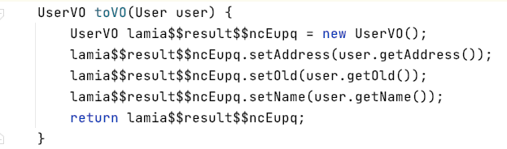


这里需要注意的是:

- 生成的实体必须要有对应的`构造方法`/`setter方法`, 如果某个字段在 `构造方法`/`setter方法`里都不存在,那么这个字段将不会被设置进去
  - 如果有多个`构造方法`,那么将会选择和`被转换对象`中最匹配的
- `被转换对象`中需要有对应的`getter`方法


# 3. 进阶教程

## 3.1 @Mapping
对于标注了注解`@Mapping`的方法, 那么在`编译期`中将会去扫描这个方法中的每一行代码, 直到扫描到语句
`Lamia.convert`, 然后根据`Lamia.convert`中配置的参数来生成对应的转换代码, 然后使用生成的代码替换掉语句
`Lamia.convert`

__注意__: 这里生成对应的转换代码后,不是整个方法去替换的,而是仅仅只是替换`Lamia.convert` 语句

如下代码所示, 在调用`Lamia.convert`之前还有,对应的打印代码
```java
    @Mapping
    void printlnUserVO(User user) {
        System.out.println("代码转换前--------------------->");
        UserVO userVO = (UserVO) Lamia.convert(user);
        System.out.println("代码转后<---------------------");
        System.out.println(userVO);
    }
```
对应生成的代码如下所示:

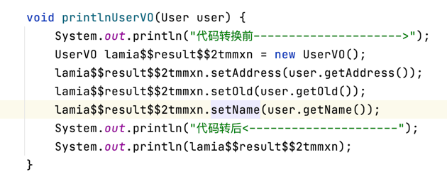

__注意__: 一个方法里面可以同时存在多个 `Lamia.convert` 语句

如下面代码所示,在一个标注了 `@Mapping`的方法中有多个转换语句
```java
    @Mapping
    void printlnUserVO(User user) {
        //转换成map
        Map<String, Object> map = (HashMap<String, Object>) Lamia.convert(user);
        System.out.println(map);
    
        //转换成userVO
        UserVO userVO = (UserVO) Lamia.convert(user);
        System.out.println(userVO);
    }
```
生成的代码如下所示

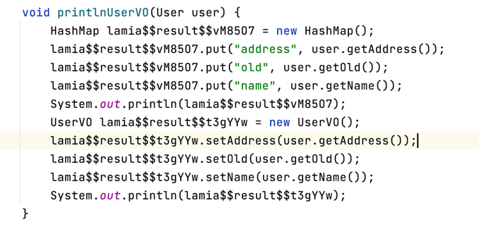


## 3.2 Lamia.convert 语句

在本框架的类`Lamia`中提供了一个 静态方法 `convert(Object... param)`, 对于应用程序来说
该方法没有任何的意义, 因为这个方法没有干任何的事情, 但是在编译期间对于本框架来说确是至关重要的
本框架的核心引擎将会把这个方法替换成真正的转换代码, 这里需要配合`@Mapping`注解使用

在调用`Lamia.convert`方法的时候,需要注意的是, 调用该方法的时候必须设置 `转换入参` ,`强转类型`, `接收属性` 三个部分

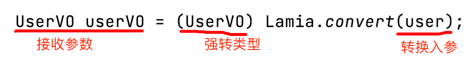


### 3.2.1 强转类型
这里`强转类型`代表的是真正生成的实例类型, 而接收参数可以是对应的`父类`, 如下所示

```java
Map<String, Object> map = (HashMap<String, Object>) Lamia.convert(user);
```
这里把`user`对象转成`Map`类型, 强转类型中使用的`HashMap`, 那么生成的真正实例就是`HashMap`

- __QA__:
    - __问__: 这里为什么要使用强转,而不是直接把要转成的类型放入方法的第一个参数如: 定义成`public static T convert(Class<T> tClass, Object... param)`
  的形式
    - __答__: 因为如果把要转换的类型放入第一参数,那么就将会丢失泛型, 如下面使用是不合法的

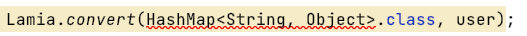    

### 3.2.2 转换入参

可以注意到,该静态方法使用的是可变参数, 所以你可以将无限多的参数给放入进去, 从而转换出一个聚合的对象.
如下所示:

```java
    @Mapping
    UserVO toVO(User user) {
        String name = "myName";
        //这里需要注意的是,UserVO对象中有一个叫做 name并且类型也是String的字段,而且有对应的setter或者构造方法
        return (UserVO) Lamia.convert(user, name);
    }
```
生成的代码如下所示:

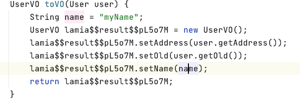

对于入参是有对应的优先级的, 默认情况下: `单独字段 > 对象中包含的字段`, 所以这里  `name > user.name`

__注意:__ 优先级是可以修改的,具体可以看 `3.3 @MapMember` 的使用


## 3.3 @MapMember

当调用`Lamia.convert(Object... param)` 方法的时候可以向方法的参数中传入需要参加转换的原数据,
`Lamia` 是通过传入参数的`字段名称`来映射对应生成对象的字段的, 那么如果我`传入的字段`名称和需要映射的字段名称不同
那么可以在对应的`传入字段`上打上`@MapMember`注解, 如下所示

```java
    @Mapping
    UserVO toVO(User user) {
        @MapMember("name") String what = "what";
        return (UserVO) Lamia.convert(user, what);
    }
```
生成的代码如下所示:

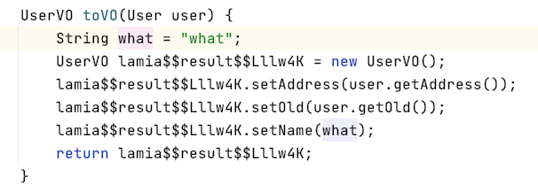


### 3.3.1 入参优先级

`Lamia.convert(Object... param)` 如果有多个入参,那么是可以设置入参的优先级的, 在不去手动设置优先级的情况下,遵循两个原则

- `单独字段 > 对象中包含的字段`, 这个上面演示过,就不过多说明了
- 如果2个字段都是`单独字段`或者都是`对象中包含的字段`的情况下, 在方法 `Lamia.convert(Object... param)` 入参中越靠前的优先级越高
具体式例如下:

```java
    @Mapping
    UserVO toVO(User user) {
        @MapMember("name") String what = "what";
        @MapMember("name") String why = "why";
        return (UserVO) Lamia.convert(user, what, why);
    }
```
  
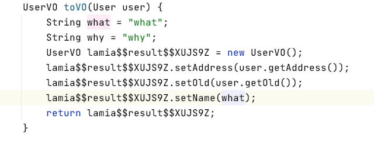

如上面也可以看出, 同样优先级的2个入参, 放前面的那个生效, 所以上述代码最后设置进去的是 `what`

如果把`默认`优先级用一个数字标识出来,那么就是

- `单独字段`: 10
- `对象中包含的字段`: 5

数字越大优先级`越高`

当然, 优先级也是可以手动去控制的, 在注解`@MapMember` 中有一个方法`priority()` 就是用来设置优先级的如下所示

```java
@Mapping
    UserVO priorityTest(User user) {
        @MapMember(value = "name", priority = 4) String what = "what";
        return (UserVO) Lamia.convert(user, what);
    }
```

`user`是用的对象里面的字段, 所以默认的优先级是`5`, 而我手动设置了`name` 变量优先级是`4`(默认是`10`) , 所以编译后的代码如下所示

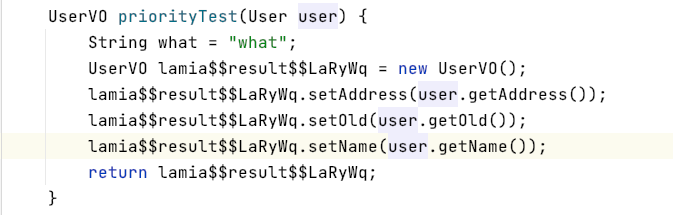

同时, `priority()` 也能作用于对象上面,让所有映射的字段都具有优先级, 如下所示:

```java

    @Mapping
    UserVO priorityTest(User user) {
        @MapMember(spread = true, priority = 2) DetailedUser detailedUser = DetailedUser.builder()
                .address("DetailedUser_address").name("DetailedUser_name")
                .email("704188931@qq.com").old(1).build();
        return (UserVO) Lamia.convert(detailedUser, user);
    }

    @Data
    @Builder
    public class User {
      String name;
      Integer old;
      String address;
    }

    @Data
    @Builder
    public class DetailedUser {
      String name;
      Integer old;
      String address;

      String email;
    }

    @Data
    public class UserVO {
      String name;
      Integer old;
      String address;

      String email;
    }

```

这里 仅仅是 `DetailedUser` 对象多了一个 `email`字段,其他字段完全一样, 那么我想`name`/`old`/`address`
三个共有字段使用`User`对立面的, 而`email`字段使用`DetailedUser`里面的, 那么仅仅只需让 `DetailedUser`的优先级高于`User`即可

所以编译后的代码如下所示:
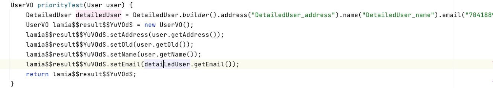


### 3.3.2 spread

当向`Lamia.convert(Object... param)`方法中传入了一个对象, 那么到底是把这个对象中的所有字段都映射到结果对象的字段中,
还是把这个对象当做一个字段放入结果对象中? 

因为这个分歧, 所以有了 `spread`, 这里`spread`的意思是 展开,扩散 的意思,这里 扩散 的是对象中的字段

在`@MapMember` 注解中有一个 `spread()` 方法用来标识这个`对象`到底需不需要 `spread`, 当然在不去写`@Mapping`注解的时候也是有`spread`默认值的

- 当对象来自`方法入参`的时候: `spread=true`
- 当对象来自`方法内部定义变量`的时候: `spread=false`

如下所示:

```java
    @Mapping
    UserVO spreadTest(User childUser) {
            return (UserVO) Lamia.convert(childUser);
    }
```
因为`childUser`参数来自于 `方法入参`, 所以默认 `spread=true`, 那么将会映射`childUser`中所有属性到`UserVO`中
编译结果如下:

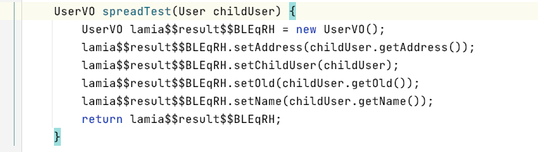

如果使用`方法内部参数`

```java
    @Mapping
    UserVO spreadTest() {
        User childUser = User.builder().address("dewdewd").name("name").old(312).build();
        return (UserVO) Lamia.convert(childUser);
    }
```
那么就将会把方法变量`childUser`当做一个字段给设置进入`UserVO.childUser` 编译结果如下:

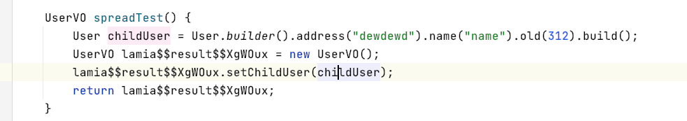

当然这里可以使用`@MapMember` 注解去更改`spread`的值, 如下所示

```java
    @Mapping
    UserVO spreadTest(@MapMember(value = "childUser", spread = false) User user) {
        @MapMember(spread = true) User childUser = User.builder().address("dewdewd").name("name").old(312).build();
        return (UserVO) Lamia.convert(childUser, user);
    }
```
编译结果如下所示

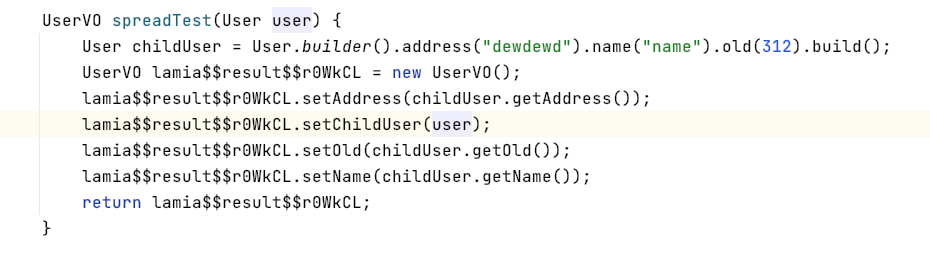


# 4. 常用数据结构的转换

`Lamia`也支持一些常用数据结构的转换

## 4.1 Map

支持对象和`map`之间的相互转换, 这里泛型将会被`擦除`, 生成的`Map`类型为`HashMap<String,Object>`, 请确保类型的统一

```java
    @Mapping
    Map<String, Object> toMap(User user) {
        return (HashMap) Lamia.convert(user);
    }

    @Mapping
    UserVO mapToUser(Map<String, Object> map) {
        return (UserVO) Lamia.convert(map);
    }
```
编译后的代码分别为:

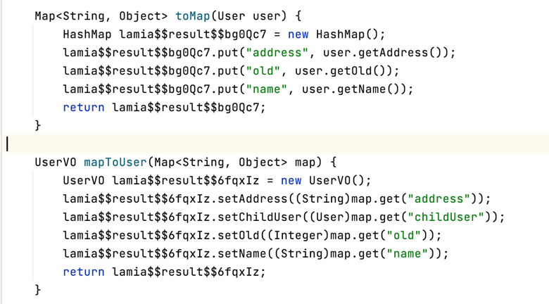


## 4.2 List之间的转换

同时也支持2个集合对象之间的转换 如: `List<User> --> List<UserVO>` 的转换

```java
    @Mapping
    void listTest(List<User> users) {
        List<UserVO> result = (List<UserVO>) Lamia.convert(users);
        //转换后的结果中再添加一个自定义对象
        result.add(new UserVO());
    }
```


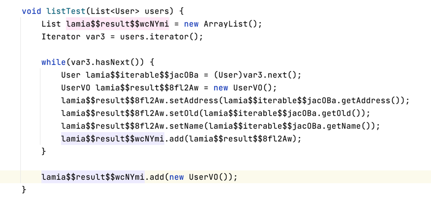

同时在两个集合相互转换的时候, 可以去覆盖某个字段的值如下:

```java
    @Mapping
    void listTest(List<User> users) {
        @MapMember(value = "name", priority = 10) String test = "listTest";
        List<UserVO> result = (List<UserVO>) Lamia.convert(users, test);
        //转换后的结果中再添加一个自定义对象
        result.add(new UserVO());
    }
```

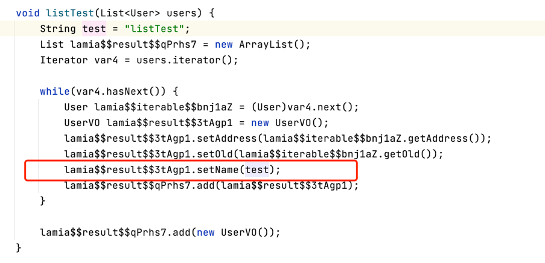


## 4.3 Optional的支持

当映射的字段 名称能够对应上, 仅仅只是类型不同的情况下, 如果发现是`Optional`的包装类型, 那么将会自动`拆/装包`,
`Optional<String> name`和`String name` 之间是可以想换转换的

定义一个实体,里面的字段都是`Optional`的如下:
```java
@Data
public class Anonymous {

  Optional<String> name;
  Optional<Integer> old;
  Optional<Integer> address;
}
```

然后和正常的`User`对象进行转换

```java
    @Mapping
    Anonymous toAnonymous(User user) {
        return (Anonymous) Lamia.convert(user);
    }

    @Mapping
    UserVO toUser(Anonymous anonymous) {
        return (UserVO) Lamia.convert(anonymous);
    }
```
编译后的代码如下所示

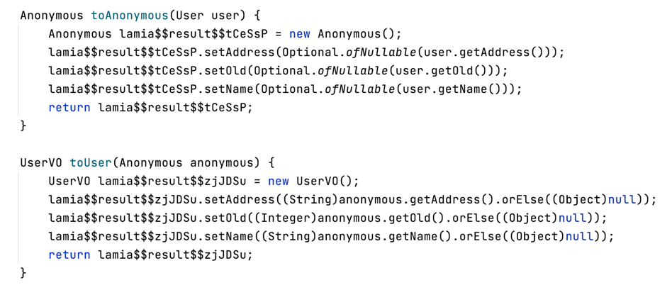


