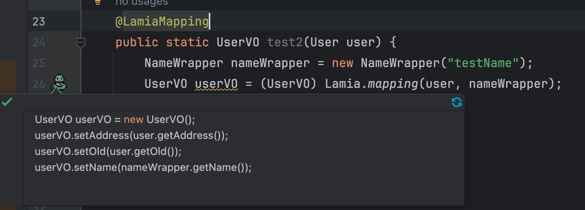
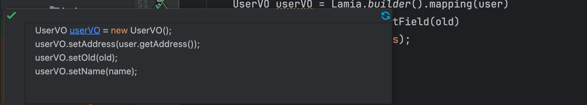

# 1. 简介

`lamia` 是一个高性能的对象转换框架, 使用简单的表达式就能帮助你在`编译期`生成对应的`转换代码`

### 1.1 优势

- 使用简单，没有繁琐的配置和接口定义，开箱即用
- 高性能的对象转换，转换性能和手写`get/set`一致
- 完善的兼容性，支持`jdk8-jdk21`等常用JDK版本以及可以和`lombok`等`AnnotationProcessor`框架同时使用  
- 在Idea插件的加持下，支持增量编译、可视化转换等 
  - 插件地址: [lamia-plugin](https://github.com/cao2068959/lamia-plugin)


# 2. 快速使用

__1.引入maven坐标__

> 引入的包分为`编译期`和`运行期`的包，`编译期`的包仅仅在编译时生成对应的转换代码
```xml
<dependencies>
  <dependency>
    <groupId>io.github.cao2068959</groupId>
    <artifactId>lamia-compile</artifactId>
    <version>2.2.2</version>
    <scope>compile</scope>
  </dependency>

  <dependency>
    <groupId>io.github.cao2068959</groupId>
    <artifactId>lamia-runtime</artifactId>
    <version>2.2.2</version>
  </dependency>
</dependencies>
```
如果你的项目中指定了编译器的`annotationProcessorPaths`, 需要把`lamia-compile` 加入其中，如下所示
```xml
<build>
        <pluginManagement>
            <plugins>
                ...
                <plugin>
                    <groupId>org.apache.maven.plugins</groupId>
                    <artifactId>maven-compiler-plugin</artifactId>
                    <version>3.8.1</version>
                    <configuration>
                        <source>${maven.compiler.source}</source>
                        <target>${maven.compiler.target}</target>
                        <annotationProcessorPaths>
                            ...你其他 AnnotationProcessor 的包，比如lombok
                            <path>
                              <groupId>io.github.cao2068959</groupId>
                              <artifactId>lamia-compile</artifactId>
                              <version>${lamia.version}</version>
                            </path>
                        </annotationProcessorPaths>
                    </configuration>
                </plugin>
            </plugins>
        </pluginManagement>
    </build>

```

__2.写一个`转换方法`并标注上注解`@@LamiaMapping`__

__3.在`转换方法`里面调用生成赋值语句的`静态方法`__
```java
T varName = (强转成你要返回的类型 比如 T)Lamia.mapping(转换的参数);
```
如果你不喜欢使用`强转`(可能某些代码规范检查的时候会提示，不安全的类型)，这边也提供了其他的方式，如下所示:
```java
T varName = Lamia.builder().mapping(转换的参数).build(T.class)
```

对应的最简`demo`如下所示

```java
public class Test {

  public static void main(String[] args) {
    User user = User.builder().old(1).name("testLamia").address("test").build();
    UserVO userVO = test(user);
    System.out.println(userVO);
  } 
    
  @LamiaMapping
  public static UserVO test(User user){
    System.out.println("-----> start");
    UserVO userVO = (UserVO) Lamia.mapping(user);

    System.out.println("-----> builder type");
    return  Lamia.builder().mapping(user).build(UserVO.class);
  }
}

@Data
@Builder
public class User {
  String name;
  Integer old;
  String address;
}

@Data
public class UserVO {
  String name;
  Integer old;
  String address;
}


```

对应编译之后的代码如下:


这里需要注意的是:

- 生成的实体必须要有对应的`构造方法`/`setter方法`, 如果某个字段在 `构造方法`/`setter方法`里都不存在,那么这个字段将不会被设置进去
  - 如果有多个`构造方法`,那么将会选择和`被转换对象`中最匹配的
- `被转换对象`中需要有对应的`getter`方法

以上就是`lamia` 最简单的用法，也是最常用的用法，你可以像使用 `beanUtils.copy` 一样来快速在业务中转换两个对象，同时又享受到极致的性能

# 3. 详细配置

在介绍详细配置的时候，会展示一些表达式最终生成的语句来让大家更加理解对应配置的作用，在文中截图展示最终生成语句的工具是`lamia Idea插件`
欢迎大家去idea插件商店下载体验
- 插件地址: [lamia-plugin](https://github.com/cao2068959/lamia-plugin)

## 3.1 注解 @LamiaMapping
- 对于标注了注解`@LamiaMapping`的方法, 那么在`编译期`中将会去扫描这个方法中的每一行代码, 直到扫描到语句
`Lamia转换语句`, 然后根据`Lamia转换语句`中配置的参数来生成对应的转换代码, 然后使用生成的代码替换掉语句
`Lamia转换语句`
- 一个方法里面可以同时存在多个 `Lamia.convert` 语句

__注意__: 这里生成对应的转换代码后,不是整个方法去替换的,而是仅仅只是替换`Lamia转换语句` 语句

## 3.2 转换函数
lamia中提供了两种最基础的转换函数来进行对象的转换，分别是
- mapping
- setField

### 3.2.1 mapping 函数

__作用__: 将mapping函数中的入参的对象映射到`目标对象`上面，这里是根据字段的`名称`去映射的，如果名称相同，但是类型不同
最终编译的时候会报类型不匹配`异常`，可以使用函数`ignoreField`来忽略掉对应的字段，具体可以看 `ignoreField` 相关章节


mapping函数使用的是可变参数，可以同时放入多个参数，多个参数如果可以映射同一个字段
那么放在后面的参数优先级更高

```java
    @LamiaMapping
    public static UserVO test2(User user) {
        NameWrapper nameWrapper = new NameWrapper("testName");
        UserVO userVO = (UserVO) Lamia.mapping(user, nameWrapper);
        return userVO;
    }

    @Data
    @AllArgsConstructor
    public class NameWrapper {
      String name;
    }
    
    // UserVo 和 User 对象结构一致
    @Data
    public class UserVO {
      String name;
      Integer old;
      String address;
    }

```
上述代码中，`NameWrapper` 和 `User` 对象中都同时拥有`name` 字段，但是 `nameWrapper` 放在了后面，优先级更高，所以最终生成代码为:



### 3.2.1 setField 函数
__作用__: setField函数将会根据入参中变量的名称来直接映射到目标对象中，类似直接写 set 函数，如:

```java
    @LamiaMapping
    public void  test4() {
        User user = new User();
        // 等同于 直接 UserWrapper.setUser(user)
        UserWrapper result = (UserWrapper)Lamia.setField(user);
    }

    @Data
    public class UserWrapper {
      User user;
    }
```

上述代码生成的代码如下:


__注意__: 这里是直接使用入参的变量名称和结果对象中的字段做映射的，所以`setField` 中的入参只能放入已经定义好的变量
不能接收一个表达式

> - 其实如果有一些额外参数更建议用户手动去set，而不是使用 setField 方法
> - 你问我这个功能的意义？ 我可以不用但是不能没有！！！


## 3.3 设置目标对象
这里`目标对象`代表的是最终需要生成的对象，`lamia`提供了三种方式来指定最终生成的对象是什么，分别是

1. 强转指定类型
2. T.class 的方式指定
3. 直接设置目标对象

- 前两种方式仅仅只是指定了`类型`，所以lamia将会根据指定类型来生成对应的`new`语句
- 后两种方式只会在`builder` 模式下提供


### 3.3.1 强转指定类型

具体用法如下:
```java
User user = ...;
// 使用强转的方式来指定 最终生成的对象的类型
UserVO userVO = (UserVO) Lamia.mapping(user);
// builder 模式下也可以使用强转来指定类型
userVO = (UserVO)Lamia.builder().mapping(user).build();
```

使用强转的优势在于可以可以去指定`泛型`，如：
```java
Map<String, Object> map = (Map<String, Object>) Lamia.mapping(user);
```

### 3.3.2 T.class 的方式指定

在 `builder` 模式下，可以去指定最终要生成的类型，如:
```java
UserVO userVO = Lamia.builder().mapping(user).build(UserVO.class);
```
### 3.3.3 设置目标对象

如果你已经有一个`半成品`的对象了，不希望lamia给你重新`new` 一个，那么可以使用此种方式

同样需要在  `builder` 模式下
```java
User user = ...;
UserVO result = ...;
// 会直接用result来进行转换，不需要接收新对象了
Lamia.builder().mapping(user).build(result);
```

## 3.4 builder 模式

除了提供最基础的转换之外，还提供了 `builder`模式来丰富配置

在builder模式之下可以 混合使用`setField` / `mapping` 函数如:

```java
        User user = new User();
        String name = "new_name";
        Integer old = 100;
        // 表达式混合转换
        UserVO userVO = Lamia.builder().mapping(user)
        .setField(name).setField(old)
        .build(UserVO.class);
```
上述表达式中，手动使用`setField` 来覆盖了字段`name`/`old`, 只有`address` 字段使用了`user`中的字段进行了映射，所以最终生成的代码如下



## 3.5 Rule

> 需要开启`builder 模式` 之后使用

除了正常的转换，lamia还内置了一些额外的规则，这些内置的小规则可能在某些场景之下能大大帮助你提高效率

`rule` 配置的规则如下所示:
```java
// 开启builder模式
Lamia.builder()
    // 开启一个规则, 这里面的规则只对 入参 bo1 生效
    .rule({使用内置规则(可选)}).{设置规则方法(可选)}.mapping(bo1)
    // 开启一个新的规则， 这里面的规则只对 入参 bo2 生效
    .rule({使用内置规则(可选)}).{设置规则方法(可选)}.mapping(bo2)
    // 设置最终要生成的类型
    .build(VO.class);

```
从上可以看出，有两个地方可以去设置规则，分别是
- `rule()` 方法的入参可以设置规则，这一类规则一般都是内置好的固定规则，比如在转换的时候忽略所有null值，会对所有字段生效
- 在rule和mapping 中间的方法可以设置一些定义好的规则，这类规则可以去设置一些指定参数，可能会有不同的效果

接下来会介绍一下当前已经内置的规则，更多的规则会`持续添加`，也欢迎各位大神一起构建

### 3.5.1 转换的时候忽略null值

使用内置规则`RuleType.IGNORE_NULL` 可以来帮助你生成

```java
        UserVO userVO = Lamia.builder().rule(RuleType.IGNORE_NULL)
                .mapping(user)
                .build(UserVO.class);
```

生成的代码如下:


### 3.5.2 转换的时候忽略指定字段

上面提到过，`lamia`是完全根据字段的名称进行映射的，所以当两个类字段名称一致，但是类型不一致的时候会导致编译报错
这时候就需要去忽略掉这些类型不匹配的字段
> - 为什么不自动判断类型然后忽略?
>   - 因为可能用户并不知道为什么这个字段转换不生效，类型不对可能他要到运行的时候才能感受到某个字段不存在了，太多的隐藏规则可能反而是一种负担，因为你不知道他什么时候
> 可能会不生效

如:类型不匹配可能会如下:
```java
// 两个 Family 相互转换
FamilyVO result = (FamilyVO) Lamia.mapping(family);

// 下面是 两个 Family 类的定义，Family中持有的 User对象不同
public class Family {
  String name;
  User user;
}

public class FamilyVO {
    String name;
    UserVO user;
}
```


> 如果在idea中配合`lamia-plugin` 使用可以在编码期就提示你类型不匹配，并且可以自动生成对应的`对策语句`,具体可以参考  [lamia-plugin](https://github.com/cao2068959/lamia-plugin)

可以看到生成的代码中，两个`user` 字段因类型不对报错了，所以需要去定义忽略掉`user`字段

使用`rule().ignoreField(你的转换类::对应字段的getter方法)` 可以忽略对应的字段，如下所示

```java
FamilyVO familyVO = Lamia.builder().rule().ignoreField(FamilyVO::getUser)
                .mapping(family)
                .build(FamilyVO.class);
```


## 3.6 对象和map的相互转换

也提供了能力，可以让对象和`map`，相互转换

对于 `对象 --> map`，需要注意现在只支持泛型`<String, Object>` 以及 `<String, String>`， 其他的泛型会报错

如:


__注意__: 在转成  `<String, String>` 的时候，因为自动使用了`toString` 为了防止出现`npe` 建议配合 规则规则`RuleType.IGNORE_NULL` 使用

默认情况之下，转成`map`, 都是使用 `new HashMap()` , 如果想设置成其他的`map`请自行创建，下面例子将展示怎么转换成`ConcurrentHashMap`:
```java
 @LamiaMapping
    public void test8() {
        User user = ...;
        Map<String, String> result = new ConcurrentHashMap<>();
        Lamia.builder().mapping(user).build(result);
    }
```

以及可以反过来，`map --> obj ` ，反向转换的时候，仅仅支持`<String, Object>`, 如下:


# 4. 其他
- 配合 [lamia-plugin](https://github.com/cao2068959/lamia-plugin) 可以获得更完整的体验
- 欢迎各路大佬来帮忙完善整个框架
- QQ交流群: 179545939


